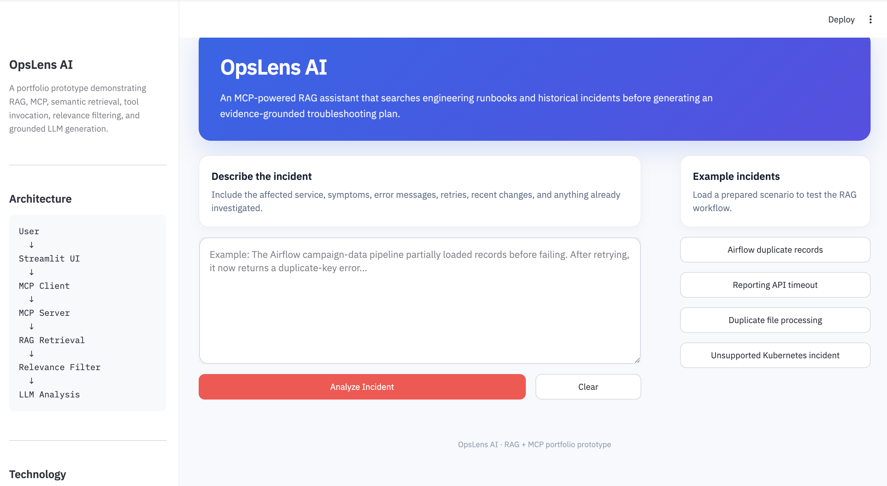
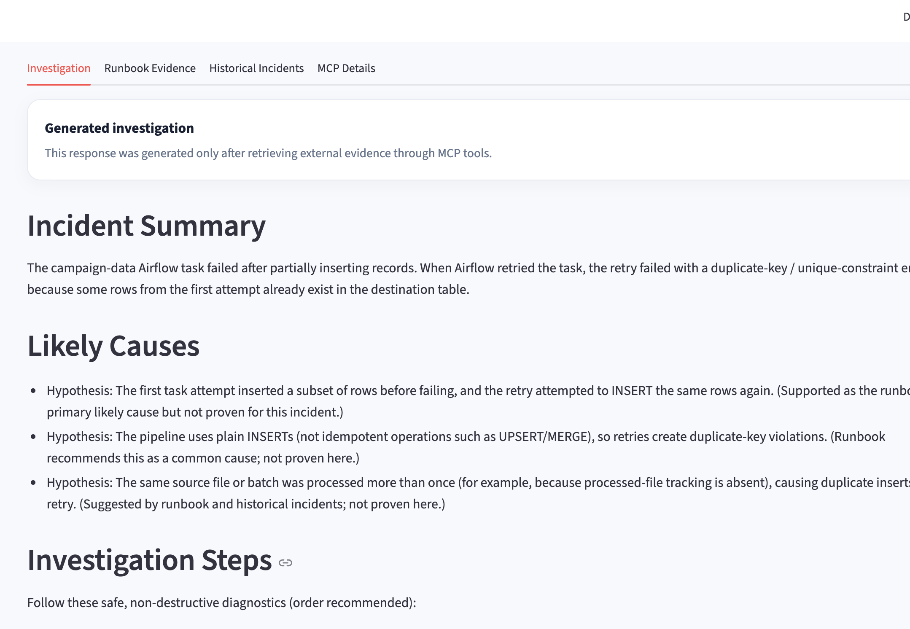
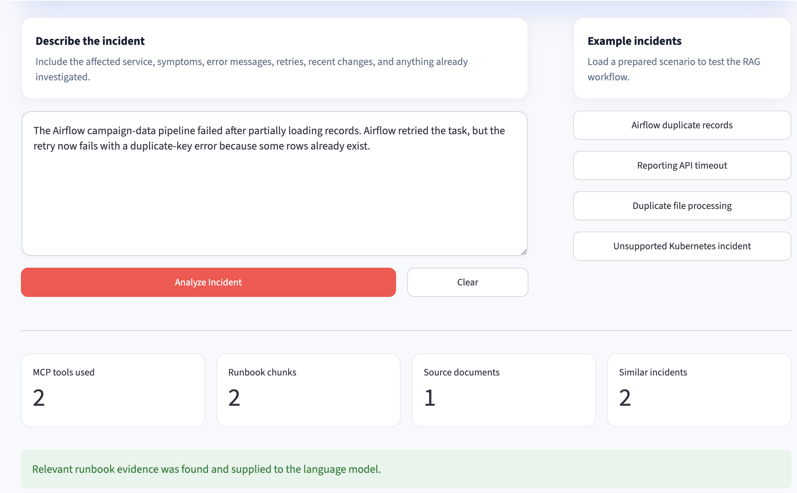
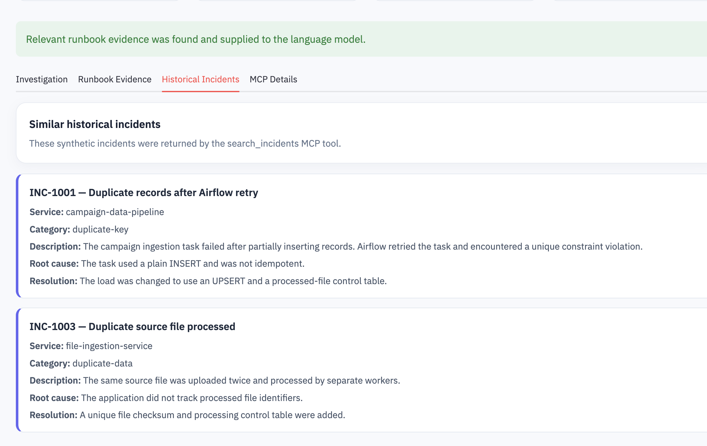
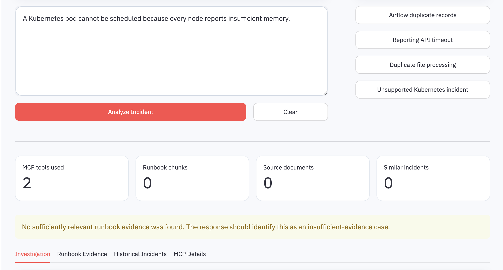

# OpsLens AI

OpsLens AI is an MCP-powered RAG assistant for engineering incident investigation.

It helps engineers search troubleshooting runbooks and historical incidents, retrieve relevant evidence, and generate a cautious investigation plan with sources, confidence, and limitations.

## Problem Statement

During a production incident, engineers often spend significant time searching for information across different systems and documents, including:

- engineering runbooks
- historical incident records
- database troubleshooting guides
- API and data-pipeline documentation
- operational notes
- knowledge held by individual team members

The information may exist, but it is often difficult to locate quickly.

Traditional keyword search can also miss relevant information when an incident is described using different terminology.

For example:

```text
The scheduled job reran after partially completing and attempted to
write the same database records again.
```

may describe the same underlying problem as:

```text
An Airflow retry caused a duplicate-key violation.
```

The wording is different, but the meaning is similar.

An engineer must normally:

1. identify the affected service
2. search multiple runbooks
3. compare the symptoms with previous incidents
4. determine possible root causes
5. decide what logs, metrics, or records to inspect
6. verify that the proposed actions are safe

This manual process can delay the beginning of an effective investigation.

## What OpsLens AI Does

OpsLens AI provides one interface where an engineer can describe an incident in natural language.

The application then:

1. searches engineering runbooks using semantic vector retrieval
2. searches for similar historical incidents
3. removes weak or unrelated retrieval results
4. sends only relevant evidence to the language model
5. generates a structured troubleshooting response
6. displays the documents and incidents used as evidence

The generated response includes:

- incident summary
- likely causes
- investigation steps
- suggested diagnostic commands
- similar historical incidents
- evidence sources
- confidence and limitations

OpsLens AI does not automatically resolve incidents or replace engineering judgment.

Its purpose is to reduce the time spent locating relevant information and help engineers begin an investigation with traceable evidence.

## Example

A user enters:

```text
The Airflow campaign-data pipeline partially loaded records before
failing. After its automatic retry, it now receives a duplicate-key
error.
```

OpsLens AI can retrieve:

- the Airflow pipeline failure runbook
- database duplicate-record guidance
- a similar historical incident

It can then explain:

- why a partial insert may have caused the retry failure
- why idempotency matters
- which task attempts and database records should be inspected
- whether the pipeline uses `INSERT`, `UPSERT`, or `MERGE`
- which sources support the investigation

## Features

- RAG-based engineering runbook search
- semantic retrieval using ChromaDB
- semantic historical-incident search
- MCP server and client integration
- MCP tool discovery and invocation
- retrieval-distance relevance filtering
- evidence-grounded LLM responses
- source attribution
- unsupported-question detection
- retrieval evaluation suite
- user-friendly error handling
- Streamlit-based portfolio interface

## Application Screenshots

### Landing Page



### Generated Incident Investigation



### Retrieved Runbook Evidence



### Similar Historical Incidents



### Unsupported Incident Handling



## Architecture

```text
User
  |
  v
Streamlit UI
  |
  v
Incident Analyzer / MCP Client
  |
  v
MCP Server
  |----------------------------|
  v                            v
search_runbooks          search_incidents
  |                            |
  v                            v
Runbook ChromaDB         Incident ChromaDB
  |                            |
  |-------- Retrieved Evidence |
                |
                v
         Relevance Filtering
                |
                v
         Prompt Augmentation
                |
                v
            OpenAI LLM
                |
                v
     Grounded Incident Analysis
```

## How RAG Works

RAG stands for **Retrieval-Augmented Generation**.

OpsLens AI uses RAG through the following process:

1. Engineering runbooks are loaded from Markdown files.
2. Each runbook is divided into overlapping chunks.
3. An embedding model converts each chunk into a numerical vector.
4. ChromaDB stores the document text, vectors, source names, and metadata.
5. The user’s incident description is converted into a query vector.
6. ChromaDB retrieves the semantically closest chunks.
7. Weak matches are removed using a vector-distance threshold.
8. The remaining evidence is added to the language-model prompt.
9. The language model generates an evidence-grounded investigation.

Without RAG, the language model would answer using only its general training knowledge.

With RAG, the model receives project-specific evidence before generating the response.

## How MCP Is Used

MCP stands for **Model Context Protocol**.

OpsLens AI runs a local MCP server that exposes the following tools:

- `search_runbooks`
- `search_incidents`
- `read_runbook`

The application acts as an MCP client. It:

1. starts the MCP server
2. initializes an MCP session
3. discovers the tools exposed by the server
4. invokes tools using structured arguments
5. receives structured retrieval results
6. passes the results into the RAG generation workflow

MCP does not replace RAG.

- **RAG** retrieves relevant knowledge and grounds the model response.
- **MCP** standardizes how the AI application accesses tools and data sources.

The current implementation uses deterministic tool orchestration. The application explicitly calls the runbook and historical-incident search tools for each investigation.

## MCP Tools

### `search_runbooks`

Searches engineering runbook chunks using semantic vector similarity.

Example input:

```json
{
  "query": "Airflow retry caused duplicate records",
  "limit": 3,
  "max_distance": 0.95
}
```

### `search_incidents`

Searches historical incidents using semantic vector similarity.

Example input:

```json
{
  "query": "A scheduled job reran and wrote the same rows again",
  "limit": 2,
  "max_distance": 1.25
}
```

### `read_runbook`

Reads the complete content of a selected Markdown runbook.

The tool validates the requested filename to prevent access outside the runbook directory.

## Technology Stack

- Python 3.12
- Streamlit
- Model Context Protocol Python SDK
- ChromaDB
- local embedding model
- OpenAI Responses API
- python-dotenv
- Git and GitHub

## Project Structure

```text
opslens-ai/
├── app.py
├── config.py
├── evaluation.py
├── incident_analyzer.py
├── incident_retrieval.py
├── llm_service.py
├── mcp_client.py
├── mcp_server.py
├── rag.py
├── requirements.txt
├── README.md
├── docs/
│   └── screenshots/
│       ├── Airflow-Historical-incident.png
│       ├── Airflow-incident-investigation.png
│       ├── Airflow-incident-response.png
│       ├── Landing-page.png
│       └── Unsupported-Incident.png
└── data/
    ├── incidents.json
    └── runbooks/
        ├── airflow_failures.md
        ├── api_timeouts.md
        └── database_errors.md
```

# Local Setup

## Prerequisites

Install or configure:

- Python 3.10 or newer
- Git
- an OpenAI API key
- a terminal
- a modern web browser

Check your Python version:

```bash
python3 --version
```

## 1. Clone the repository

```bash
git clone https://github.com/vp1410/opslens-ai.git
cd opslens-ai
```

## 2. Create a virtual environment

```bash
python3 -m venv .venv
```

Activate it on macOS or Linux:

```bash
source .venv/bin/activate
```

Activate it on Windows PowerShell:

```powershell
.venv\Scripts\Activate.ps1
```

After activation, the terminal should begin with:

```text
(.venv)
```

## 3. Install dependencies

```bash
python -m pip install --upgrade pip
python -m pip install -r requirements.txt
```

## 4. Configure environment variables

Create a `.env` file in the project root:

```bash
touch .env
```

Add:

```env
OPENAI_API_KEY=your_openai_api_key
OPENAI_MODEL=gpt-5-mini
```

The `.env` file must not be committed to GitHub.

The repository’s `.gitignore` should include:

```gitignore
.env
.venv/
__pycache__/
*.pyc
chroma_db/
.DS_Store
.streamlit/
```

## 5. Build and test the runbook index

```bash
python rag.py
```

This command:

- loads the Markdown runbooks
- divides them into chunks
- generates local embeddings
- stores the chunks in ChromaDB
- runs a sample semantic search

## 6. Build and test the historical-incident index

```bash
python incident_retrieval.py
```

This command:

- loads the synthetic incident records
- creates one searchable document per incident
- generates embeddings
- stores them in a separate ChromaDB collection
- runs a sample semantic search

The generated vector database is stored in:

```text
chroma_db/
```

This directory is generated locally and is excluded from Git.

## 7. Validate the MCP server

```bash
python -c "import mcp_server; print('MCP server valid')"
```

Expected output:

```text
MCP server valid
```

## 8. Test the MCP client

```bash
python mcp_client.py
```

This validates:

- MCP server startup
- session initialization
- tool discovery
- tool schemas
- tool invocation
- structured tool responses

## 9. Test the complete analysis workflow

```bash
python incident_analyzer.py
```

This runs:

```text
Incident description
  |
  v
MCP retrieval tools
  |
  v
Semantic evidence retrieval
  |
  v
Relevance filtering
  |
  v
Prompt augmentation
  |
  v
OpenAI generation
```

## 10. Run the evaluation suite

```bash
python evaluation.py
```

Expected output:

```text
Evaluation result: 4/4 passed
```

The evaluation suite tests:

- Airflow duplicate-retry retrieval
- API-timeout retrieval
- duplicate-source-file retrieval
- unsupported Kubernetes incident rejection

## 11. Start the application

```bash
python -m streamlit run app.py
```

The application should open at:

```text
http://localhost:8501
```

# Example Incidents

## Airflow Duplicate-Key Failure

```text
The Airflow campaign-data pipeline partially loaded records before
failing. After its automatic retry, it now receives a duplicate-key
error.
```

Expected retrieval:

- `airflow_failures.md`
- `INC-1001`
- potentially other duplicate-record evidence that passes the threshold

## API Timeout

```text
The reporting API returns HTTP 504 errors during high traffic.
Database requests are slow and the application connection pool appears
exhausted.
```

Expected retrieval:

- `api_timeouts.md`
- `INC-1002`

## Duplicate Source File

```text
The ingestion service processed the same source file twice and created
duplicate rows.
```

Expected retrieval:

- `INC-1003`
- relevant duplicate-record guidance when it passes the threshold

## Unsupported Kubernetes Incident

```text
A Kubernetes pod cannot be scheduled because every node reports
insufficient memory.
```

Expected behavior:

- unrelated runbook chunks are removed
- unrelated historical incidents are removed
- the model reports insufficient evidence
- unsupported Kubernetes commands are not generated

# Retrieval Relevance Filtering

Vector databases return nearest neighbors even when none of the available documents are genuinely relevant.

OpsLens AI applies maximum-distance thresholds before retrieved content is sent to the language model.

Current thresholds:

```text
Runbook maximum distance: 0.95
Historical incident maximum distance: 1.25
```

Smaller distances indicate stronger semantic similarity.

Results exceeding the configured threshold are removed.

The current values were selected using supported and unsupported evaluation queries.

## Retrieval Evaluation

The evaluation suite checks whether:

- at least one acceptable runbook is retrieved
- an acceptable historical incident is retrieved when required
- supported queries receive evidence
- unsupported queries receive no evidence

The evaluation intentionally accepts multiple valid retrieval results rather than requiring one exact document ordering.

Run it with:

```bash
python evaluation.py
```

## Safety and Reliability

The project includes:

- synthetic knowledge-base content only
- API keys stored outside source control
- path-traversal protection for runbook access
- retrieval relevance thresholds
- explicit insufficient-evidence behavior
- separation between evidence and hypotheses
- no automatic execution of generated commands
- no destructive production actions without review
- user-friendly API and application error handling
- retrieval tests for supported and unsupported queries

## Current Limitations

- small synthetic knowledge base
- local embedding model
- local ChromaDB storage
- MCP server uses stdio
- MCP server starts as a subprocess for each analysis
- limited historical-incident dataset
- no authentication or user accounts
- no direct access to production logs or monitoring systems
- recommendations still require human review
- response latency may be noticeable during local execution

## Future Improvements

- persistent Streamable HTTP MCP server
- response streaming
- faster model configuration
- concurrent MCP tool calls
- retrieval caching
- hybrid keyword and vector retrieval
- reranking
- automated RAG-quality metrics
- LangGraph workflow orchestration
- Amazon Bedrock support
- S3-based document ingestion
- OpenTelemetry or CloudWatch observability
- Jira, PagerDuty, Datadog, or ServiceNow integrations
- user authentication and role-based access controls

## Interview Summary

> OpsLens AI is an MCP-powered RAG incident investigation assistant. Engineering runbooks and historical incidents are embedded and stored in ChromaDB. When a user describes an incident, the application invokes MCP tools to retrieve semantically relevant evidence. It applies vector-distance thresholds to remove weak matches, augments the LLM prompt with the retrieved context, and generates a cautious investigation with likely causes, diagnostic steps, sources, confidence, and limitations.

## Disclaimer

OpsLens AI is a portfolio prototype.

Generated recommendations must be reviewed by a qualified engineer before they are used in a production environment.